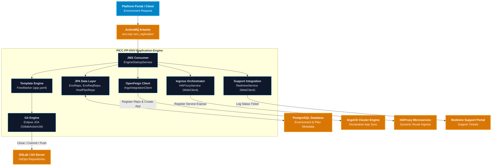

# PICC-PP-ENV-Replication-Engine

[](https://openjdk.org/projects/jdk/21/)
[](https://spring.io/projects/spring-boot)
[](https://spring.io/projects/spring-cloud)
[](https://argo-cd.readthedocs.io/)
[](https://activemq.apache.org/components/artemis/)
[](LICENSE)
[]()

Automated Environment Replication and GitOps Orchestration Microservice providing event-driven environment provisioning, declarative manifest generation, ArgoCD application lifecycle synchronization, dynamic HAProxy ingress routing, and support tracking across the **Platform Portal (PP)** suite of the **Nubo Native Platform (NNP)**.

---

## Table of Contents

- [Overview](#overview)
- [Key Architectural Features](#key-architectural-features)
- [Architecture and Ecosystem](#architecture-and-ecosystem)
- [Technology Matrix](#technology-matrix)
- [Quick Start](#quick-start)
  - [Prerequisites](#prerequisites)
  - [Configuration](#configuration)
  - [Local Execution](#local-execution)
  - [Docker Container Execution](#docker-container-execution)
  - [Docker Compose Multi-Container Orchestration](#docker-compose-multi-container-orchestration)
- [Workflow and Lifecycle](#workflow-and-lifecycle)
- [Project Documentation](#project-documentation)
- [Repository Structure](#repository-structure)
- [Security and Vulnerability Management](#security-and-vulnerability-management)
- [Contributing](#contributing)
- [License](#license)

---

## Overview

**`PICC-PP-ENV-Replication-Engine`** provides the automated backend orchestration engine for replicating, provisioning, and synchronizing customer environments. Triggered asynchronously by JMS messages upon environment creation requests, it generates declarative Kubernetes and ArgoCD manifests via **FreeMarker** templates, manages GitOps repositories using **Eclipse JGit**, configures **ArgoCD** applications via **Spring Cloud OpenFeign**, registers routing in **HAProxy**, and logs operational status in **Redmine**.

Inheriting from the platform's standardized BOM ([`PICC-PC-Abstract-NNP-Platform`](https://github.com/Nubo-Native-Platform/PICC-PC-Abstract-NNP-Platform)), `PICC-PP-ENV-Replication-Engine` enforces Java 21 LTS runtime standards, containerized microservice guidelines, and automated DevSecOps compliance scanning.

---

## Key Architectural Features

- **Event-Driven Asynchronous Provisioning**: Consumes environment replication requests via **Apache ActiveMQ Artemis** JMS queues with request-level MDC/ThreadContext tracking.
- **Declarative GitOps Pipelines**: Generates root ArgoCD Application manifests and child component Kubernetes manifests using high-performance **FreeMarker** templates.
- **Automated Repository Synchronization**: Uses embedded **Eclipse JGit** for secure, authenticated cloning, file generation, committing, and pushing to GitOps repositories.
- **Zero-Touch ArgoCD Orchestration**: Integrates with ArgoCD's REST API via **Spring Cloud OpenFeign** to automatically issue session JWT tokens, register Git repositories, and trigger automated sync policies.
- **Dynamic Ingress Orchestration**: Coordinates with **HAProxy** ([`PICC-PC-Haproxy-Integration`](https://github.com/Nubo-Native-Platform/PICC-PC-Haproxy-Integration)) and persists ingress routes with domain naming patterns (`{component}-{env}.{baseDomain}`).
- **Dynamic Secret Generation**: Automatically requests and encodes registry credentials and personal access tokens (PATs) for container image pulling.
- **DevSecOps Security Pipeline**:
  - **SAST**: SpotBugs + FindSecBugs security rules (`spotbugs-exclude.xml`).
  - **SCA**: OWASP Dependency-Check enforcing zero CVSS >= 7.0 vulnerabilities.
  - **SBOM**: CycloneDX plugin generating immutable Software Bill of Materials (`bom.json`).

---

## Architecture and Ecosystem



---

## Technology Matrix

| Category | Component / Library | Version | Role / Description |
| :--- | :--- | :--- | :--- |
| **Runtime** | Java JDK | `21` (LTS) | Long-Term Support Java runtime environment |
| **Parent BOM** | `abstract-nnp` | `1.0.0` | Standardized enterprise parent and dependency governance |
| **Framework** | `spring-boot-starter-web` | `3.5.4` | Enterprise microservice application framework |
| **Messaging** | `spring-boot-starter-artemis` | `3.5.4` | JMS client for Apache ActiveMQ Artemis |
| **Data / Persistence** | `spring-boot-starter-data-jpa` | `3.5.4` | Spring Data JPA with PostgreSQL driver |
| **Templating** | `spring-boot-starter-freemarker` | `3.5.4` | Template engine for declarative manifest rendering |
| **Git Automation** | `org.eclipse.jgit` | Latest | Embedded Java library for Git operations |
| **Cloud / RPC** | `spring-cloud-starter-openfeign` | `2025.0.0` | Declarative REST client for ArgoCD API |
| **Reactive Client** | `spring-boot-starter-webflux` | `3.5.4` | Reactive WebClient for HAProxy and Redmine APIs |
| **API Documentation** | `springdoc-openapi-starter-webmvc-ui` | `2.8.5` | OpenAPI 3.0 and Swagger UI interactive docs |
| **Observability** | `spring-boot-starter-actuator` | `3.5.4` | Operational health and metrics endpoints |

---

## Quick Start

### Prerequisites

- **Java JDK 21+** (Eclipse Temurin recommended)
- **Maven 3.9+** (or use `./mvnw`)
- **Docker & Docker Compose**
- **PostgreSQL 15+** and **Apache ActiveMQ Artemis 2.30+**

### Configuration

Copy the template configuration file:

```bash
cp .env.example .env
```

Adjust the values in `.env` to configure your database, message broker, Git server, and ArgoCD endpoints.

### Local Execution

```bash
# Build the project
./mvnw clean package -DskipTests

# Run the Spring Boot application
./mvnw spring-boot:run
```

The service will start on port `8082` (or your configured `SERVER_PORT`).

- **Swagger UI**: [http://localhost:8082/swagger-ui.html](http://localhost:8082/swagger-ui.html)
- **Health Check**: [http://localhost:8082/actuator/health](http://localhost:8082/actuator/health)

### Docker Container Execution

```bash
# Build the Docker image
docker build -t picc-pp-env-replication-engine:latest .

# Run container with environment configuration
docker run -d --name envrep-engine \
  --env-file .env \
  -p 8082:8082 \
  picc-pp-env-replication-engine:latest
```

### Docker Compose Multi-Container Orchestration

Start the engine along with PostgreSQL and ActiveMQ Artemis:

```bash
docker-compose up -d
```

---

## Workflow and Lifecycle

1. **Trigger**: An environment replication message arrives on JMS queue `env-rep::env_replication` (`reqId|admin_user|password|email`).
2. **Retrieve Context**: Queries PostgreSQL for `EnvRequest`, target `Environment`, dedicated/shared components, and compute quotas (`HostPlan`).
3. **Secret Generation**: Obtains dynamic Docker image pull credentials for container registries.
4. **Clone Repository**: Clones the target environment GitOps repository into a dedicated request directory (`gitops/{reqId}`).
5. **Render Manifests**: FreeMarker renders `template/app.yaml` and component-specific manifests using square bracket syntax (`[=...]`).
6. **Sync to Git & ArgoCD**:
   - Pushes rendered manifests to the GitOps Git repository using Eclipse JGit.
   - Registers the repository and root application with ArgoCD via OpenFeign REST client.
7. **Configure Ingress & Ticketing**:
   - Persists routing entries in `EnvProxyConfig` and coordinates with HAProxy.
   - Creates support tracking entries in Redmine.
8. **Cleanup**: Transient working directory is automatically removed in a `finally` block.

---

## Project Documentation

Detailed engineering and operational manuals are available:

- [DEVELOPMENT_GUIDELINES.md](DEVELOPMENT_GUIDELINES.md): Architectural standards, coding conventions, FreeMarker security, and PR checklist.
- [USER_MANUAL_AND_DEPLOYMENT_GUIDE.md](USER_MANUAL_AND_DEPLOYMENT_GUIDE.md): Operational workflows, configuration reference, and Kubernetes deployment guides.

---

## Repository Structure

```
.
├── .github/workflows/ci-cd.yml        # GitHub Actions CI/CD Pipeline
├── .env.example                       # Environment variables configuration template
├── .gitattributes                     # Line-ending normalization rules
├── .gitignore                         # Secret, artifact, and IDE exclusion patterns
├── Dockerfile                         # Eclipse Temurin 21 unprivileged containerfile
├── docker-compose.yml                 # Local multi-container development environment
├── LICENSE                            # Apache License 2.0
├── pom.xml                            # Maven project definition and profiles
├── README.md                          # Repository documentation
├── spotbugs-exclude.xml               # SAST suppression rules
├── template/
│   └── app.yaml                       # Root ArgoCD FreeMarker application template
├── src/
│   ├── main/
│   │   ├── java/com/nnp/envrep/       # Service source code
│   │   └── resources/
│   │       ├── application.properties
│   │       ├── application-dev.properties
│   │       └── application-main.properties
│   └── test/
│       └── java/com/nnp/envrep/       # Automated unit tests
```

---

## Security and Vulnerability Management

This project strictly adheres to open-source security best practices:
- **No hardcoded secrets or credentials**: All configuration values are externalized via environment variables.
- **Non-root container execution**: Runtime container executes as unprivileged `appuser`.
- **Automated DevSecOps scanning**: Integrated SpotBugs SAST, OWASP Dependency-Check SCA, and CycloneDX SBOM generation.

Report security issues confidentially to **contribution@nubons.com**. See [SECURITY.md](SECURITY.md).

---

## Contributing

We welcome community contributions! Please read [CONTRIBUTING.md](CONTRIBUTING.md) and [CODE_OF_CONDUCT.md](CODE_OF_CONDUCT.md) before submitting pull requests.

---

## License

This project is licensed under the **Apache License 2.0**. See the [LICENSE](LICENSE) file for details.