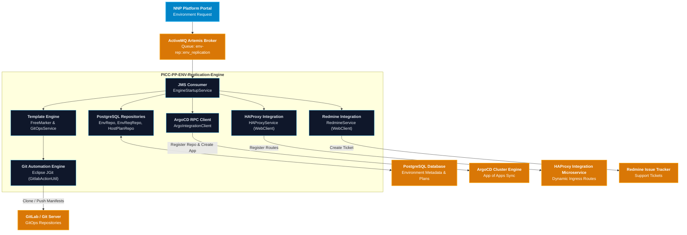

# User Manual and Deployment Guide: `PICC-PP-ENV-Replication-Engine`

This document provides an end-to-end operational, architectural, and deployment guide for the **`PICC-PP-ENV-Replication-Engine`** microservice within the **Nubo Native Platform (NNP)**.

---

## Table of Contents

1. [Service Architecture & Role](#1-service-architecture--role)
2. [Prerequisites & System Requirements](#2-prerequisites--system-requirements)
3. [Configuration Reference & Profiles](#3-configuration-reference--profiles)
   - [Application Properties Matrix](#application-properties-matrix)
   - [Configuration Profiles](#configuration-profiles)
   - [Centralized Config Server Integration](#centralized-config-server-integration)
4. [Functional Workflows & Lifecycle Operations](#4-functional-workflows--lifecycle-operations)
   - [Replication Request Ingestion (ActiveMQ Artemis)](#replication-request-ingestion-activemq-artemis)
   - [GitOps Repository Synchronization (GitLab & JGit)](#gitops-repository-synchronization-gitlab--jgit)
   - [Manifest Generation (FreeMarker Templates)](#manifest-generation-freemarker-templates)
   - [ArgoCD Root & Child Application Deployment](#argocd-root--child-application-deployment)
   - [Ingress Routing Configuration (HAProxy)](#ingress-routing-configuration-haproxy)
   - [Support Ticketing Tracking (Redmine)](#support-ticketing-tracking-redmine)
5. [Local Build & Containerization](#5-local-build--containerization)
   - [Local Build with Maven](#local-build-with-maven)
   - [Docker Container Build & Execution](#docker-container-build--execution)
   - [Docker Compose Multi-Container Orchestration](#docker-compose-multi-container-orchestration)
6. [Production Deployment on Kubernetes](#6-production-deployment-on-kubernetes)
   - [Kubernetes Deployment & Service Manifest](#kubernetes-deployment--service-manifest)
   - [ConfigMap and Secret Manifests](#configmap-and-secret-manifests)
7. [Troubleshooting & Frequently Asked Questions](#7-troubleshooting--frequently-asked-questions)

---

## 1. Service Architecture & Role

`PICC-PP-ENV-Replication-Engine` automates the complete provisioning and replication lifecycle of dedicated and shared application environments.



---

## 2. Prerequisites & System Requirements

| Prerequisite | Minimum Version | Recommended Version | Purpose |
| :--- | :--- | :--- | :--- |
| **Java JDK** | `21` | `21.0.10` (Eclipse Temurin) | Runtime & compilation environment |
| **Maven** | `3.9.0` | `3.9.9` (via `./mvnw`) | Dependency management & packaging |
| **PostgreSQL** | `14.0` | `16.0` | Environment and component specifications DB |
| **Apache ActiveMQ Artemis** | `2.28.0` | `2.33.0` | Message queuing for environment requests |
| **Git / GitLab** | `2.30+` | Latest | GitOps repository storage and versioning |
| **ArgoCD** | `2.8+` | `2.10+` | GitOps continuous delivery and sync engine |
| **Docker** | `24.0+` | Latest | Container runtime |

---

## 3. Configuration Reference & Profiles

### Application Properties Matrix

| Property Name | Environment Variable | Default Value | Description |
| :--- | :--- | :--- | :--- |
| `server.port` | `SERVER_PORT` | `8082` | HTTP listen port |
| `spring.profiles.active` | `SPRING_PROFILES_ACTIVE` | `main` | Active profile (`dev`, `main`, `local`) |
| `spring.datasource.url` | `DATASOURCE_URL` | `jdbc:postgresql://localhost:5432/eiimp-platform` | PostgreSQL JDBC connection URL |
| `spring.datasource.username` | `DATASOURCE_USERNAME` | `postgres` | Database username |
| `spring.datasource.password` | `DATASOURCE_PASSWORD` | `postgres` | Database password |
| `spring.activemq.broker-url` | `ACTIVEMQ_BROKER_URL` | `tcp://localhost:61616` | ActiveMQ Artemis broker endpoint |
| `spring.activemq.user` | `ACTIVEMQ_USER` | `artemis` | ActiveMQ broker username |
| `spring.activemq.password` | `ACTIVEMQ_PASSWORD` | `artemis` | ActiveMQ broker password |
| `gitops.folder` | `GITOPS_FOLDER` | `./gitops` | Local staging folder for Git clone/push |
| `gitops.gitlabUrl` | `GITOPS_GITLAB_URL` | `https://gitlab.example.com` | Base Git server URL |
| `gitops.repopath` | `GITOPS_REPOPATH` | `/env-replication-gitops/${env}-synch.git` | GitOps repository path template |
| `gitops.template` | `GITOPS_TEMPLATE` | `./template` | Path to FreeMarker templates folder |
| `gitlab.repo.user` | `GITLAB_REPO_USER` | `gitops-bot` | Git bot username for pushing manifests |
| `gitlab.repo.password` | `GITLAB_REPO_PASSWORD` | *(empty)* | Git bot personal access token or password |
| `argo.user` | `ARGO_USER` | `admin` | ArgoCD admin username |
| `argo.pass` | `ARGO_PASSWORD` | *(empty)* | ArgoCD admin password |
| `feign.url` | `FEIGN_URL` | `http://localhost:8080` | ArgoCD server base URL |
| `feign.url.api` | `FEIGN_URL_API` | `/api/v1` | ArgoCD REST API path prefix |
| `haproxy.service.baseurl` | `HAPROXY_SERVICE_BASEURL` | `http://localhost:8081` | HAProxy integration service URL |
| `haproxy.base.domain` | `HAPROXY_BASE_DOMAIN` | `nnp.nubons.com` | Ingress base domain suffix |
| `redmine.service.baseurl` | `REDMINE_SERVICE_BASEURL` | `http://localhost:8095/redmineint` | Redmine integration service URL |
| `redmine.apiKey` | `REDMINE_API_KEY` | *(empty)* | Redmine REST API Key |

### Configuration Profiles
- **`dev`**: Local development profile with verbose SQL and Feign logging enabled.
- **`main`**: Production profile optimized for minimal logging and centralized config server import.

---

## 4. Functional Workflows & Lifecycle Operations

### Replication Request Ingestion (ActiveMQ Artemis)
The engine listens on queue `env-rep::env_replication`. Messages arrive formatted as:
```
<reqId>|<admin_username>|<admin_password>|<admin_email>
```
Example: `REQ-20260911-001|admin|SecurePassword123!|admin@example.com`

### GitOps Repository Synchronization (GitLab & JGit)
1. Fetches `EnvRequest` and target `Environment` from the database.
2. Clones the designated environment GitOps repository into `<gitops.folder>/<reqId>`.
3. Ensures clean sandbox isolation so concurrent provisioning jobs do not collide.

### Manifest Generation (FreeMarker Templates)
1. FreeMarker loads `template/app.yaml` to generate the root ArgoCD Application manifest.
2. Iterates over all dedicated components (`EnvReqComponent`) and generates child application and Kubernetes resource manifests (Deployment, Service, Namespace quotas).
3. Automatically sets node affinity groups and compute limits (CPU, memory, storage) based on `HostPlan`.

### ArgoCD Root & Child Application Deployment
1. Generates an ArgoCD JWT session token using admin credentials.
2. Registers the GitOps Git repository with ArgoCD via `POST /api/v1/repositories`.
3. Pushes the root application manifest to ArgoCD via `POST /api/v1/applications`.
4. Pushes generated YAML files to the Git repository via Eclipse JGit. ArgoCD automatically synchronizes the cluster state.

### Ingress Routing Configuration (HAProxy)
1. Inspects components with `proxyExpose=true`.
2. Persists route configuration into `EnvProxyConfig` (`portal.env_proxy_config`) with target internal ports and domains (`<component>-<env>.<baseDomain>`).
3. Sends registration requests to `PICC-PC-Haproxy-Integration`.

---

## 5. Local Build & Containerization

### Local Build with Maven
```bash
# Build the application JAR
./mvnw clean package -DskipTests

# Run tests
./mvnw test
```

### Docker Container Build & Execution
```bash
# Build Docker image
docker build -t picc-pp-env-replication-engine:latest .

# Run container with environment file
docker run -d --name envrep-engine \
  --env-file .env \
  -p 8082:8082 \
  picc-pp-env-replication-engine:latest
```

### Docker Compose Multi-Container Orchestration
Run the entire stack locally (Engine + PostgreSQL + ActiveMQ Artemis):
```bash
docker-compose up -d
```
Verify health status:
```bash
curl http://localhost:8082/actuator/health
```

---

## 6. Production Deployment on Kubernetes

### Kubernetes Deployment & Service Manifest

```yaml
apiVersion: apps/v1
kind: Deployment
metadata:
  name: envrep-engine
  namespace: nnp-core-components
  labels:
    app: envrep-engine
spec:
  replicas: 2
  selector:
    matchLabels:
      app: envrep-engine
  template:
    metadata:
      labels:
        app: envrep-engine
    spec:
      containers:
        - name: envrep-engine
          image: ghcr.io/nubo-native-platform/picc-pp-env-replication-engine:latest
          imagePullPolicy: IfNotPresent
          ports:
            - containerPort: 8082
              name: http
          envFrom:
            - configMapRef:
                name: envrep-engine-config
            - secretRef:
                name: envrep-engine-secrets
          resources:
            requests:
              cpu: "500m"
              memory: "1Gi"
            limits:
              cpu: "2000m"
              memory: "2Gi"
          readinessProbe:
            httpGet:
              path: /actuator/health/readiness
              port: 8082
            initialDelaySeconds: 20
            periodSeconds: 10
          livenessProbe:
            httpGet:
              path: /actuator/health/liveness
              port: 8082
            initialDelaySeconds: 30
            periodSeconds: 15
---
apiVersion: v1
kind: Service
metadata:
  name: envrep-engine-service
  namespace: nnp-core-components
spec:
  type: ClusterIP
  ports:
    - port: 8082
      targetPort: 8082
      name: http
  selector:
    app: envrep-engine
```

---

## 7. Troubleshooting & Frequently Asked Questions

### 1. ActiveMQ JMS Connection Refused
- **Cause**: Artemis broker is unreachable at `ACTIVEMQ_BROKER_URL`.
- **Remedy**: Verify network connectivity and ensure the Artemis broker is active and listening on port `61616`.

### 2. Git Clone / Push Authentication Failure
- **Cause**: Invalid `GITLAB_REPO_USER` or `GITLAB_REPO_PASSWORD`.
- **Remedy**: Ensure the Git bot account has Write / Maintainer permissions on the target Git group and the personal access token (PAT) has `read_repository` and `write_repository` scopes.

### 3. FreeMarker Template Not Found
- **Cause**: `gitops.template` folder does not contain `app.yaml`.
- **Remedy**: Verify the `template/app.yaml` file exists and that the `GITOPS_TEMPLATE` environment variable correctly points to its directory.

### 4. ArgoCD Token Generation Fails
- **Cause**: ArgoCD credentials (`ARGO_USER`, `ARGO_PASSWORD`) or URL (`FEIGN_URL`) are incorrect.
- **Remedy**: Verify ArgoCD credentials manually using `curl -k -X POST https://<argo-url>/api/v1/session -d '{"username":"admin","password":"<pass>"}'`.
